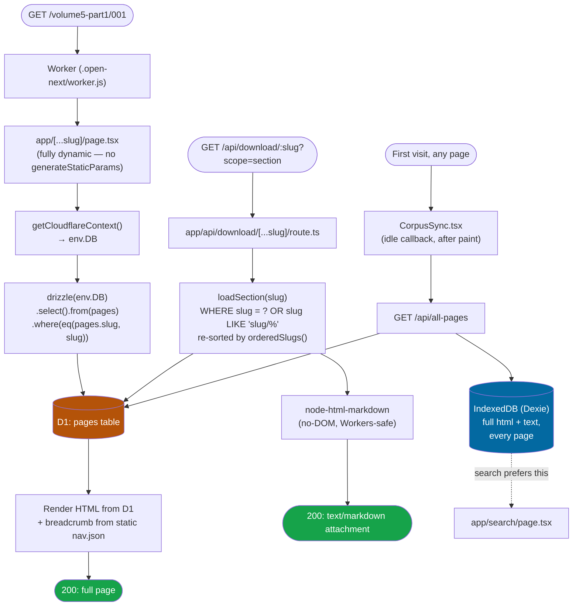

# CLAUDE.md — Web UI

Instructions for AI agents working in this directory. See [README.md](README.md) for setup/deploy
commands and [../CLAUDE.md](../CLAUDE.md) for the whole-repo pipeline this app is Phase 3 of.

## What this is

Next.js (App Router) app, deployed as a single Cloudflare Worker via `@opennextjs/cloudflare` —
one Worker for UI pages *and* `/api/*` route handlers, no separate API service. Content pages are
rendered dynamically per request from Cloudflare D1 (`src/lib/content.ts`); there is no
static-generation/ISR cache layer (no R2, deliberately — see README's "Why D1 and not R2" note).
`pnpm` throughout.

## Request flow

## Rules to preserve

- **Never run `wrangler d1 execute --remote`, `wrangler deploy`, or `pnpm run deploy` without the
  user explicitly saying so for that specific change.** This is a live public site
  (financialhandbook.exciseup.in). Local `--local` D1 work, `pnpm dev`, and `pnpm run preview`
  (real Workers runtime, local D1) don't need to ask.
- **Content routes are intentionally NOT statically generated** (no `generateStaticParams` on
  `[...slug]/page.tsx`). Static generation on OpenNext needs its incremental cache, which needs an
  R2 bucket — R2 requires a Cloudflare card on file even on the free tier, which this project
  avoids. Don't add `generateStaticParams` without also adding that cache; a bare static-assets
  binding does not serve dynamic-route pages on its own.
- **`nav.json` is bundled/imported directly (`src/lib/content.ts`'s `getNav()`), not stored in
  D1.** It's small (~160 KB) and needed on every request for the sidebar/breadcrumbs; only page
  *body HTML* lives in D1. Don't move it into D1 "for consistency" — that would add a query to
  every request for no benefit.
- **Two-step regeneration, always both steps**: `../build_content.py` (raw/ + manifest.json →
  `content/nav.json` + `content/pages/*.json`) then `../generate_seed_sql.py` +
  `wrangler d1 execute --file=seed.sql` (local and/or remote). Editing `content/pages/*.json` by
  hand does nothing to the live site — D1 is what's actually read at request time.
- **Large page HTML is chunked in `seed.sql`** (`generate_seed_sql.py`'s `CHUNK_SIZE`) — D1 caps a
  single SQL statement's text around 100 KB; pages over that start as an empty-string INSERT
  followed by `UPDATE … SET html = html || '<chunk>'` statements. Don't "simplify" this back to one
  INSERT per page without re-checking the largest page's HTML size first.
- **`node-html-markdown`, not `turndown`**, for the `.md` download route — `turndown` needs a real
  DOM (`document`/`DOMParser`), which doesn't exist in the Workers runtime. `node-html-markdown` is
  parser-based and was chosen specifically because it works without one; verify any replacement
  the same way (`node -e "require('pkg').translate(...)"` isn't sufficient — test it under
  `wrangler dev`, since Node's `require` succeeding doesn't mean the Workers `workerd` runtime
  will).
- **Icons/manifest are generated PNGs (`web/public/icon-*.png`, `favicon.svg`), not designed
  assets** — a simple amber book glyph, matching `--ui-accent`. Regenerate via Pillow if the accent
  color or brand ever changes; don't hand-edit the PNGs.
- **Slugs are generated from each page's title, not its source filename** (`build_content.py`'s
  `unique_leaf_slug()` — slugify with a per-parent collision counter, `-2`/`-3`… suffix on
  clash). Changing title-extraction logic changes URLs; if that ever needs to happen, always do a
  full `build_content.py` → `generate_seed_sql.py` → `wrangler d1 execute --file=seed.sql` cycle
  (both `--local` and `--remote`, `DELETE FROM pages;` is the first line of `seed.sql` so it's a
  clean replace, not an incremental merge) — a partial reseed leaves stale slugs live.
- **Reading order (prev/next, and the order pages appear in a `?scope=section` download) comes
  from `nav.json`'s tree structure (`content.ts`'s `orderedSlugs()`), not from sorting slugs as
  strings.** This matters now that slugs are title-based — `"chapter-ii"` sorts before
  `"chapter-x"` alphabetically, which is wrong; `nav.json`'s children arrays are already in the
  crawl's real document order regardless of what the slug text looks like. There is no `order`
  column in D1 — don't add one to "fix" ordering; the tree already has it.
- **`loading.tsx` on `[...slug]` is load-bearing for perceived speed, not decoration.** Content
  routes are fully dynamic (no `generateStaticParams`), so every navigation is a real D1 round
  trip; without a `loading.tsx`, Next shows nothing until that resolves and navigation feels like
  a full-page reload even though it's client-side. Don't delete it to "simplify."
- **Kruti Dev is a non-Unicode "hack" font**, not a real Devanagari Unicode font — ~1000 source
  pages use `` (and 2 use "010") where the underlying bytes are plain
  ASCII that only display as Hindi when rendered with that specific font's glyph mapping.
  `build_content.py`'s cleaning step deliberately preserves the `face` attribute (only strips
  `color`/`bgcolor`); `globals.css` registers `web/public/fonts/kruti-dev-010.ttf` under *both*
  family names (only one `.ttf` was available; "010"/"020" are glyph-compatible weight variants of
  the same encoding). This is scoped by construction — nothing in the app's own UI ever sets
  font-family to either name, so it can never leak into real Unicode Hindi or the general UI font
  stack. Don't add a second real Devanagari webfont under either of these two family names.
- **`globals.css`'s `.handbook-content font[face="Kruti Dev 010"/"020"]` rules are load-bearing —
  don't remove them.** A bare `` attribute is the *weakest* declaration in the
  entire CSS cascade, weaker than even an inherited author rule, so without these rules
  `.reading-content`'s `font-family: var(--reading-font-family)` (set by `CustomizationPanel.tsx`)
  would win over it the moment a user picks any non-default reading font, turning Kruti Dev text
  back into raw ASCII gibberish. Targeting the element directly (`font[face=...]`) always outranks
  a presentational hint regardless of ancestor rules. Verify any future reading-customization change
  against a Kruti Dev page (e.g. `/volume5-part1/supplementary-forms`) with the font picker set to
  something other than the default.
- **Bookmarks are local-only, stored in the same Dexie/IndexedDB database as the offline corpus
  cache (`src/lib/client-db.ts`'s `bookmarks` table, version 2), never D1 or any server.**
  `SelectionMenu.tsx` shows a small Copy/Bookmark popup on any text selection inside
  `.handbook-content` (scoped via `closest('.handbook-content')` so selecting sidebar/customize-
  panel text never triggers it); its buttons use `onMouseDown={e => e.preventDefault()}` to stop
  the browser from collapsing the selection before `onClick` fires — don't remove that guard, it's
  not decorative. `BookmarksDrawer.tsx` mirrors `Shell.tsx`'s sidebar slide pattern
  (`translate-x-full`/`translate-x-0`, right-anchored instead of left) and refetches on the
  `handbook-bookmarks-changed` window event (`notifyBookmarksChanged()`) rather than a live-query
  library, since `dexie-react-hooks` isn't a dependency and a plain event is enough for this one
  drawer. Page context (title/volume label) for a saved bookmark comes from
  `src/lib/page-context.ts`, which only imports `NavNode`/`NavVolume` as types from
  `content.ts` — never import `content.ts` itself into a client component, it also pulls in
  `@opennextjs/cloudflare` and Drizzle, which are server/Workers-only.
- **Share uses the Web Share API with a clipboard fallback, since PWA-installed users have no
  address bar to copy a URL from.** `ShareButton.tsx` (page/chapter/volume header — the same
  `[...slug]` route serves all three, so one button covers them) and `SelectionMenu.tsx`'s Share
  action (selected text) both call `navigator.share()` when present and fall back to
  `navigator.clipboard.writeText()` with a "Link copied" confirmation when it isn't (most desktop
  browsers). Feature-detect with `!!navigator.share`, not a UA check.
- **Offline fallback is a plain HTML+vanilla-JS file (`public/offline-shell.html`), not a Next.js
  route** — it has to work when the Next.js RSC/D1 request has already failed, so it can't depend
  on the framework being reachable. It reads the requested page straight out of the raw IndexedDB
  API (same DB `client-db.ts`'s Dexie instance manages) using `location.pathname` as the slug — the
  browser keeps the real URL in the address bar even though the service worker served this file's
  content for it. **Reference it as `/offline-shell` (no extension) everywhere** (`sw.js`'s
  `PRECACHE` array and its fetch-fallback `caches.match(...)`) — requesting the `.html` URL
  directly gets a 307 to the extensionless path (Next.js's public-folder clean-URL behavior), and
  a cached 307 doesn't serve real content when the service worker looks it up. It has no sidebar
  (no access to `nav.json`, which is only bundled into the Next.js app) but does have a Home link
  and a flat "Available offline" list built at runtime from the same `pages` IndexedDB store
  (`store.getAll()`, grouped by each cached row's own `volume` field) — don't mistake the missing
  sidebar for a missing feature; it's a deliberate, framework-free substitute.
- **Don't add `src/app/favicon.ico`.** Next.js's file-convention system serves and links any file
  at that path regardless of the real icon set already registered via `metadata.icons`, and some
  link-preview scrapers fall back to the favicon when no `og:image` is present — a stray
  `create-next-app` default there is enough to leak into share previews. The real icons are
  `metadata.icons` (root `layout.tsx`) plus `openGraph.images`/`twitter.images` (root `layout.tsx`
  *and* `[...slug]/page.tsx`'s `generateMetadata`, both pointing at `/icon-512.png` — Next's
  metadata merging replaces a parent's whole `openGraph` object when a child route defines its own,
  so the image has to be set in both places, not just the root).
- **There are two unrelated things both called "accent" — know which one a given class touches.**
  `--accent`/`--accent-foreground` (defined in `:root`/`.dark` near the top of `globals.css`) are
  shadcn scaffold tokens, a neutral near-white/near-black pair meant for subtle hover backgrounds;
  nothing in this app's own components actually uses them. `--ui-accent`/`--ui-accent-dark` are the
  real brand accent (amber by default, switchable via `data-accent`), consumed by this app's own
  hand-written `.text-accent`/`.bg-accent`/`.border-accent`/etc. classes further down the file. The
  `@theme inline` block's `--color-accent: var(--ui-accent)` line is what makes *Tailwind-generated*
  utilities that reference the theme's "accent" color — anything using a `text-accent`/`bg-accent`
  class Tailwind itself resolves, including compound modifiers like `prose-a:text-accent` that can't
  be given a hand-written override — pick up the brand color instead of the unused shadcn one. Don't
  point `--color-accent` back at shadcn's `--accent`; a class name matching "accent" anywhere in
  this app should always mean the brand color. `.dark { --ui-accent: var(--ui-accent-dark); }` is
  what makes `--ui-accent` itself resolve to the correct value per theme for those Tailwind-derived
  utilities — the hand-written classes additionally hardcode their own `.dark` variant for the same
  reason, which is redundant with this rule but harmless.

## Design system

`globals.css`'s token system (light/dark OKLCH palette, `--ui-accent` color switcher,
`--reading-*` customization variables), `ThemeToggle.tsx`, `CustomizationPanel.tsx` (font/size/
line-height/width/accent FAB), and `ui/button.tsx` + `ui/card.tsx` (`@base-ui/react` +
`class-variance-authority`) are the source of truth for this app's look. Check these existing
components first before adding a new UI pattern.
